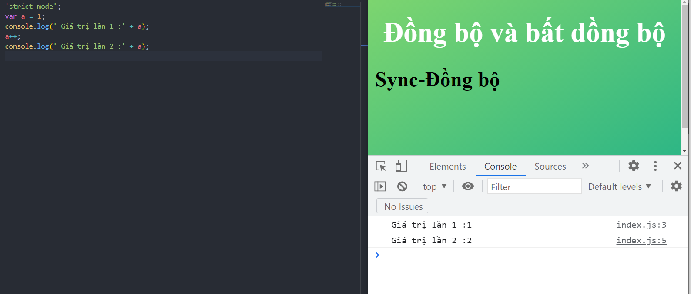
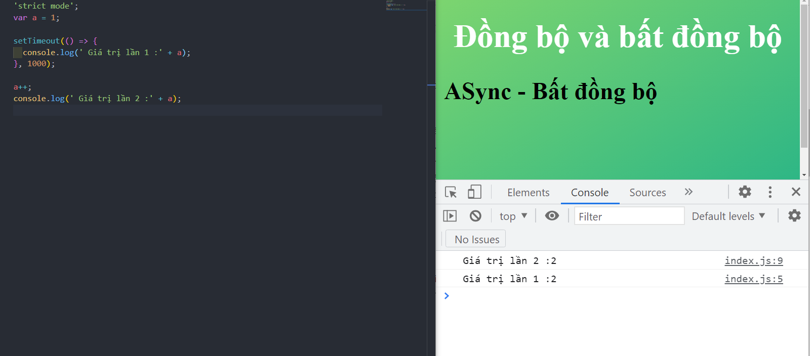

# Đồng bộ và bất đồng bộ

---

- [1. Đồng bộ](#1-đồng-bộ)
- [2. Bất đồng bộ](#2-bất-đồng-bộ)

---

## 1. Đồng bộ

- Đồng bộ là việc thực thi các câu lệnh theo thứ tự từ trên xuống, câu lệnh phía trước thực thi xong thì mới thực thi câu lệnh kết tiếp.
- Tại 1 thời điểm chỉ thực thi 1 luồng dữ liệu.

```js
var a = 1;
console.log(" Giá trị lần 1 :" + a);
a++;
console.log(" Giá trị lần 2 :" + a);
```



## 2. Bất đồng bộ

- Việc thực thi không cần theo thứ tự, không cần chờ thực thi xong câu lệnh trước, mà cùng 1 lúc có thể chạy nhiều tiến trình.
- Cùng 1 thời điểm có thể chạy nhiều luồng dữ liệu.
- Ví dụ: Câu lệnh `setTimeOut` là 1 câu lệnh thực hiện câu lệnh sau 1 khoảng thời gian là 1s.

```js
var a = 1;

setTimeout(() => {
  console.log(" Giá trị lần 1 :" + a);
}, 1000);

a++;
console.log(" Giá trị lần 2 :" + a);
```



- Ở ví dụ này:
  - Việc log kết quả `Giá trị lần 2` được thực hiện trước và có giá trị `2`.
  - Sau đó 1 giây mới log kết quả `Giá trị lần 1` trong khối lệnh `setTimeOut`.
  - Câu lệnh sau được in log ra trước câu lệnh đầu.
