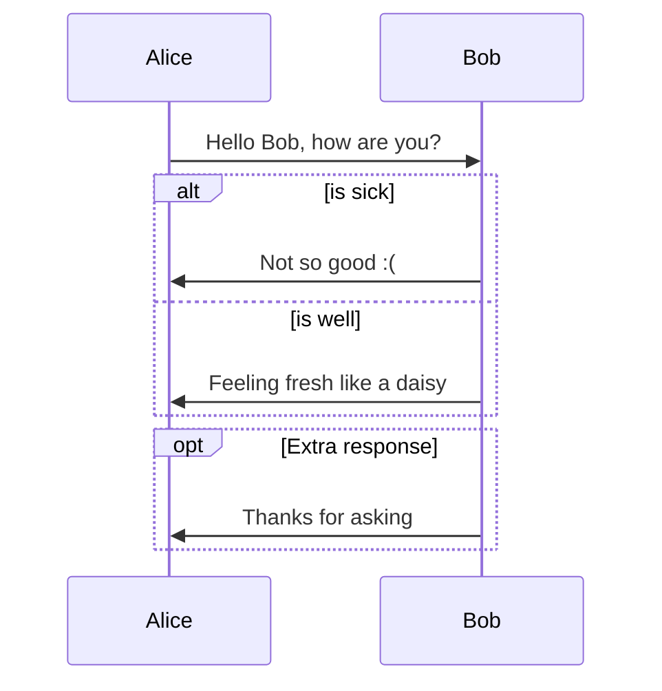

# 🤔MAYBE YOU DON'T KNOW - 👌Using Node-Postgres in Node.js Express✨

In this article, we'll walk you through a step-by-step guide on using node-postgres with Node.js Express. We'll apply it to a real project, making it easy to understand, flexible, and scalable. We'll also implement some important mechanisms like singleton, repository, query on two databases for read and write, and a reconnect mechanism when disconnected from the database.

# Introduction to Node-Postgres

Node-Postgres is a popular PostgreSQL client library for Node.js. It allows you to interact with a PostgreSQL database easily and efficiently. With its simple API, you can execute queries, manage transactions, and utilize connection pooling for better performance.

# Source Structure

Here's an overview of the source structure for this project:


```flow
node-postgres-demo/
|-- initdb/
|   |-- init.sql
|-- repositories/
|   |-- userRepository.js
|-- .env
|-- db.js
|-- docker-compose.yml
|-- Dockerfile
|-- index.js
|-- package.json
```




# Setting Up the Project

Before diving into the code, make sure you have the following installed:

- Node.js (14.x or higher)
- PostgreSQL (9.6 or higher)

> If you have docker, you can also run this project without these.

First, create a new directory for your project and navigate to it:

```bash
mkdir node-postgres-demo
cd node-postgres-demo
```

Initialize a new Node.js project and install the necessary dependencies:

```bash
npm init -y
npm install express pg dotenv
npm install nodemon --save-dev
```

# Creating a Singleton Connection Pool

A connection pool is a cache of database connections maintained to improve performance. To create a singleton connection pool, we'll use the `pg` package and the Singleton design pattern.

Create a new file called `db.js` and paste the following code:

```js
const { Pool } = require('pg');

class Singleton {
    constructor(connectionString) {
        if (!Singleton.instances) {
            Singleton.instances = {};
        }
        if (!Singleton.instances[connectionString]) {
            const pool = this.createPool(connectionString);
            Singleton.instances[connectionString] = pool;
        }
    }

    getInstance(connectionString) {
        return Singleton.instances[connectionString];
    }

    createPool(connectionString) {
        const pool = new Pool({ connectionString });

        pool.on('error', (err, client) => {
            console.error('Unexpected error on idle client: ', connectionString);
            setTimeout(() => {
                console.log('Attempting to reconnect...: ', connectionString);
                Singleton.instances[connectionString] = this.createPool(connectionString);
            }, 5000);
        });

        pool.on('connect', () => {
            console.log('Connected to the database');
        });

        return pool;
    }
}

module.exports = Singleton;
```

Now, you can use the `Singleton` class to get a connection pool instance in other parts of your application.

# Implementing the Repository Pattern

The repository pattern helps abstract the data access logic, making it more maintainable and testable. Create a new folder called `repositories` and create a new file inside it called `userRepository.js`:

```js
const Singleton = require('../db');

class UserRepository {
    constructor() {
        this.readPool = new Singleton(process.env.READ_DATABASE_URL).getInstance(process.env.READ_DATABASE_URL);
        this.writePool = new Singleton(process.env.WRITE_DATABASE_URL).getInstance(process.env.WRITE_DATABASE_URL);
    }

    async getUserById(id) {
        const res = await this.readPool.query('SELECT * FROM users WHERE id = $1', [id]);
        return res.rows[0];
    }

    async createUser(user) {
        const res = await this.writePool.query('INSERT INTO users (name, email) VALUES ($1, $2) RETURNING *', [user.name, user.email]);
        return res.rows[0];
    }

    async updateUser(id, user) {
        const res = await this.writePool.query('UPDATE users SET name = $1, email = $2 WHERE id = $3 RETURNING *', [user.name, user.email, id]);
        return res.rows[0];
    }

    async deleteUser(id) {
        const res = await this.writePool.query('DELETE FROM users WHERE id = $1 RETURNING *', [id]);
        return res.rows[0];
    }
}

module.exports = UserRepository;
```

# Environment Configuration

Create a `.env` file in the project root directory to store the environment variables:

```none
READ_DATABASE_URL=postgres://user:password@db_read:5432/db_read
WRITE_DATABASE_URL=postgres://user:password@db_write:5432/db_write
PORT=3000
```

Make sure to replace `your_read_db_connection_string` and `your_write_db_connection_string` with your actual PostgreSQL connection strings.

# Package.json and Entry Point

You can also modify the `package.json` file in the project root directory with the following content:

```yml
{
  "name": "node-postgres-demo",
  "version": "1.0.0",
  "description": "",
  "main": "index.js",
  "scripts": {
    "start": "node index.js"
  },
  "keywords": [],
  "author": "",
  "license": "ISC",
  "dependencies": {
    "dotenv": "^10.0.0",
    "express": "^4.17.1",
    "pg": "^8.7.1"
  }
}
```

If you have modified the `package.json` file re-run this command:

```bash
npm i
```

Create an `index.js` file in the project root directory:

```js
const express = require('express');
const UserRepository = require('./repositories/userRepository');
require('dotenv').config();

const app = express();
app.use(express.json());
const userRepository = new UserRepository();

app.get('/users/:id', async (req, res) => {
    try {
        const user = await userRepository.getUserById(req.params.id);
        if (user) {
            res.json(user);
        } else {
            res.status(404).send('User not found');
        }
    } catch (error) {
        console.error(error);
        res.status(500).send('Internal server error');
    }
});

app.post('/users', async (req, res) => {
    try {
        const newUser = await userRepository.createUser(req.body);
        res.status(201).json(newUser);
    } catch (error) {
        console.error(error);
        res.status(500).send('Internal server error');
    }
});

app.put('/users/:id', async (req, res) => {
    try {
        const updatedUser = await userRepository.updateUser(req.params.id, req.body);
        if (updatedUser) {
            res.json(updatedUser);
        } else {
            res.status(404).send('User not found');
        }
    } catch (error) {
        console.error(error);
        res.status(500).send('Internal server error');
    }
});

app.delete('/users/:id', async (req, res) => {
    try {
        const deletedUser = await userRepository.deleteUser(req.params.id);
        if (deletedUser) {
            res.json(deletedUser);
        } else {
            res.status(404).send('User not found');
        }
    } catch (error) {
        console.error(error);
        res.status(500).send('Internal server error');
    }
});

const PORT = process.env.PORT || 3000;

app.listen(PORT, () => {
    console.log(`Server is running on port ${PORT}`);
});
```

Now you have a complete Node.js Express application using node-postgres, with a singleton connection pool, the repository pattern, querying multiple databases for read and write operations, and a reconnect mechanism when disconnected from the database.

To run the application, use the following command if you have available the Postgres DB if not then the next step:

```bash
npm start
```

# Docker Configuration and Initialize Sample Data

To initialize the sample data for the `users` table, we can use a SQL script that runs when the PostgreSQL container starts. Create a new folder called `initdb` in your project's root directory, and inside the `initdb` folder, create a file called `init.sql` with the following content:

```sql
CREATE TABLE IF NOT EXISTS users (
    id SERIAL PRIMARY KEY,
    name VARCHAR(255) NOT NULL,
    email VARCHAR(255) UNIQUE NOT NULL
);
INSERT INTO users (name, email)
VALUES ('Alice', 'alice@example.com'),
    ('Bob', 'bob@example.com'),
    ('Charlie', 'charlie@example.com');
```

This script will create a `users` table if it doesn't exist and insert three sample users into the table.

Let's create a new file called `Dockerfile` and paste the following code:

```Dockerfile
FROM node:16

WORKDIR /app

COPY package*.json ./

RUN npm install

COPY . .

EXPOSE 3000

CMD ["npm", "start"]
```

Now, create a new file called `docker-compose.yml` and paste the following code:

```yml
version: '3.9'

services:
  app:
    build: .
    ports:
      - '${PORT}:${PORT}'
    depends_on:
      - db_read
      - db_write
    environment:
      - READ_DATABASE_URL=${READ_DATABASE_URL}
      - WRITE_DATABASE_URL=${WRITE_DATABASE_URL}
    volumes:
      - .:/app

  db_read:
    image: postgres:12-alpine
    environment:
      - POSTGRES_USER=user
      - POSTGRES_PASSWORD=password
      - POSTGRES_DB=db_read
    volumes:
      - ./initdb:/docker-entrypoint-initdb.d

  db_write:
    image: postgres:12-alpine
    environment:
      - POSTGRES_USER=user
      - POSTGRES_PASSWORD=password
      - POSTGRES_DB=db_write
    volumes:
      - ./initdb:/docker-entrypoint-initdb.d
```

To run the application with Docker Compose, use the following command:

```bash
docker-compose up
```

When the containers start, the `users` table will be created and populated with sample data. And the node application is also started in the container.

# Conclusion

In this article, we've covered how to use `node-postgres` with `Node.js Express`, implementing a singleton connection pool, the repository pattern, querying multiple databases for read and write operations, and a reconnect mechanism. By following this guide, you can build a flexible, scalable, and maintainable application using `node-postgres`.

[Tổng hợp 10 thư viện và framework Node.js đang được Trending để nâng cao khả năng phát triển web của bạn (viblo.asia)](https://viblo.asia/p/tong-hop-10-thu-vien-va-framework-nodejs-dang-duoc-trending-de-nang-cao-kha-nang-phat-trien-web-cua-ban-y37Ldx20Lov)

