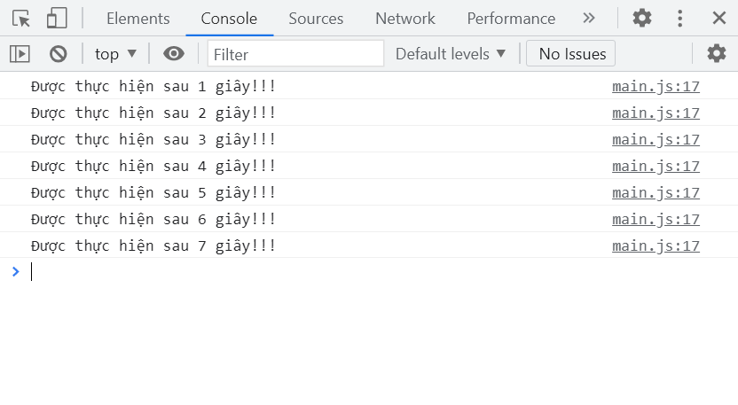

#  MỘT SỐ HÀM BUILT-IN
  
  
Một số hàm Built-in(được xây dựng sẵn) thường dùng là:
  
1. alert
2. console
3. confirm
4. prompt
5. set timeout
6. set interval
7. warning
8. error
  
---
  
##  1. Alert()
  
  
##  2. console
  
  
```js
console.log('Đây là Log.');
console.warn('Đây là cảnh báo!');
console.error('Đây là Lỗi!');
```
  

  
##  3. confirm
  
  
Dùng để xác nhận một nội dung nào đó, lựa chọn `OK` hoặc `Cancel`
  
```js
var isEnough = Boolean(confirm('Bạn đã trên 18+ ?'));
  
if (isEnough) {
  console.log('Bạn đã trưởng thành!');
} else console.log('Em chưa 18!!!');
```
  
##  4. prompt
  
  
```js
var firstName = prompt('Nhập tên của bạn vào:');
  
alert(`Chào ${firstName}, chúc một ngày tốt lành!!!`);
```
  
##  5. set timeout
  
  
Sau một thời gian sẽ thực hiện 1 một đoạn lệnh
  
```js
setTimeout(function () {
  console.log(`Được thực hiện sau 2 giây!!!`);
}, 2000); // 1000 là 1000ms = 1s
```
  
##  6. set interval
  
  
```js
let i = 0;
setInterval(function () {
  i++;
  console.log(`Được thực hiện sau ${i} giây!!!`);
}, 1000); // 1000 là 1000ms = 1s
```
  

  
---
  
##  Bài tập
  
  
Tạo biến fullName có giá trị là tên của bạn
Sử dụng hàm alert để hiển thị giá trị của biến fullName
Tạo thêm các biến sau:
  
- _message_ có giá trị 'Học về built-in functions trong JS'
- `warnMessage` có giá trị 'Đây là message cảnh báo'
- `errorMessage` có giá trị 'Đây là message lỗi'
- Sử dụng console.log để in giá trị biến message ra tab console
- Sử dụng console.warn để in giá trị biến warnMessage ra tab console
- Sử dụng console.error để in giá trị biến errorMessage ra tab console
  
> Các hàm built-in khác các bạn tự tạo file trên máy tính cá nhân để thử nghiệm. Vì lý do bảo mật nên công cụ làm bài tập tại F8 chưa tích hợp những hàm built-in đó.
  
###  Built-in function
  
  
`Built-in function` nghĩa là hàm cài sẵn, chức năng lập sẵn. Hiểu đơn giản là những hàm được tích hợp sẵn trong ngôn ngữ lập trình.
  
Ví dụ các về các **_built-in functions_** mình đã giới thiệu và làm ví dụ trong video rồi nên giờ chúng ta cùng làm bài tập nhé.
  