| Month | Savings |
| -------- | ------- |
| January | $250 |
| February | $80 |
| March | $420 |

| Item              | In Stock | Price |
| :---------------- | :------: | ----: |
| Python Hat        |   True   | 23.99 |
| SQL Hat           |   True   | 23.99 |
| Codecademy Tee    |  False   | 19.99 |
| Codecademy Hoodie |  False   | 42.99 |

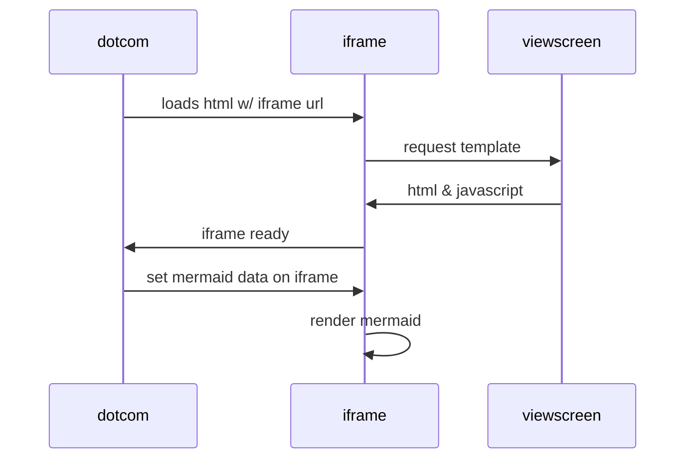

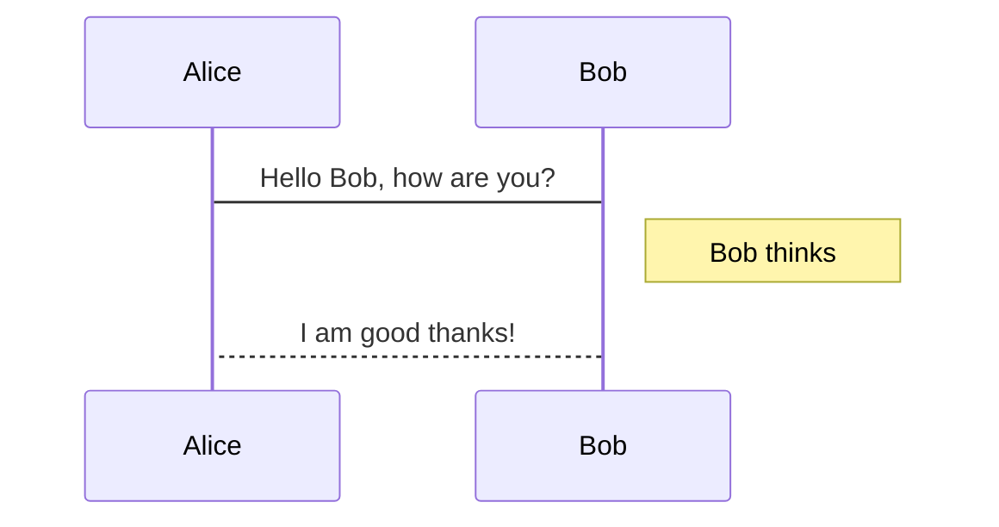

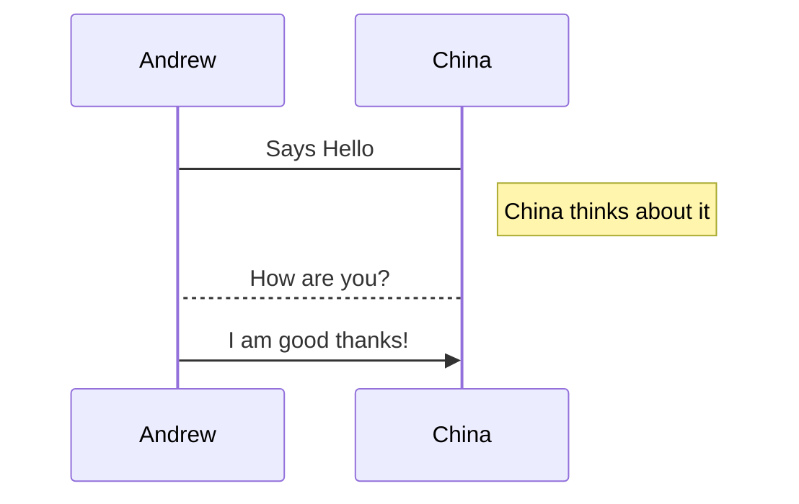

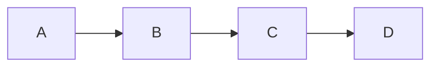

  
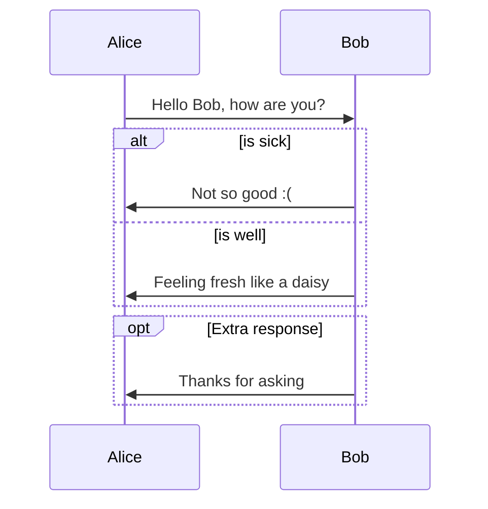

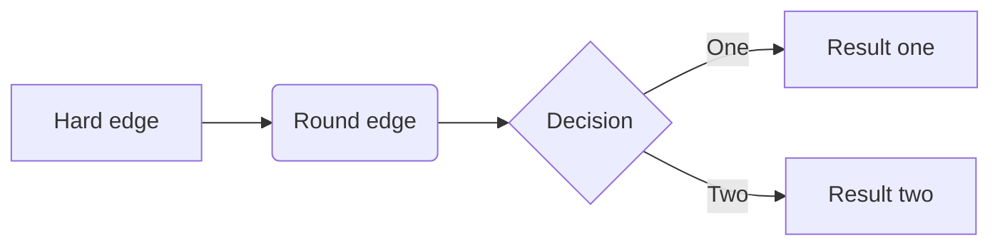

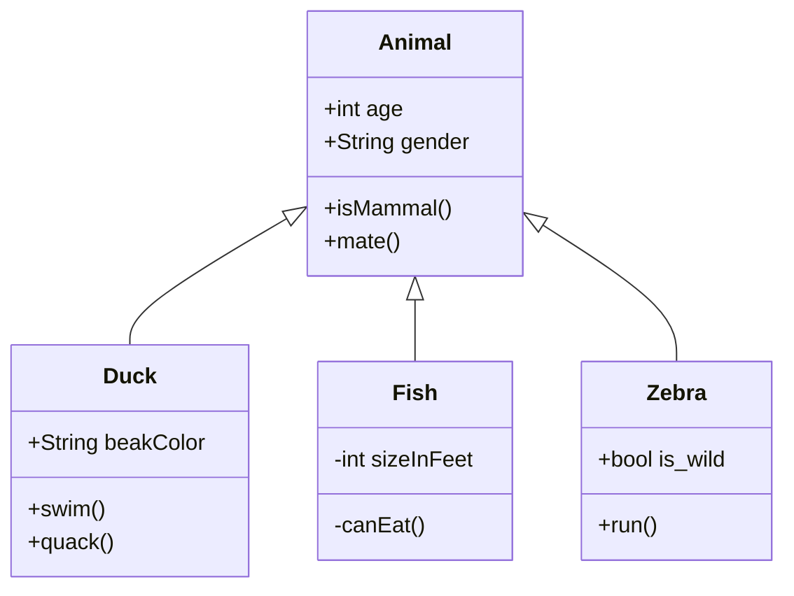

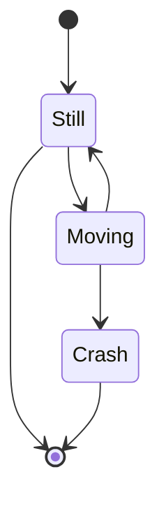

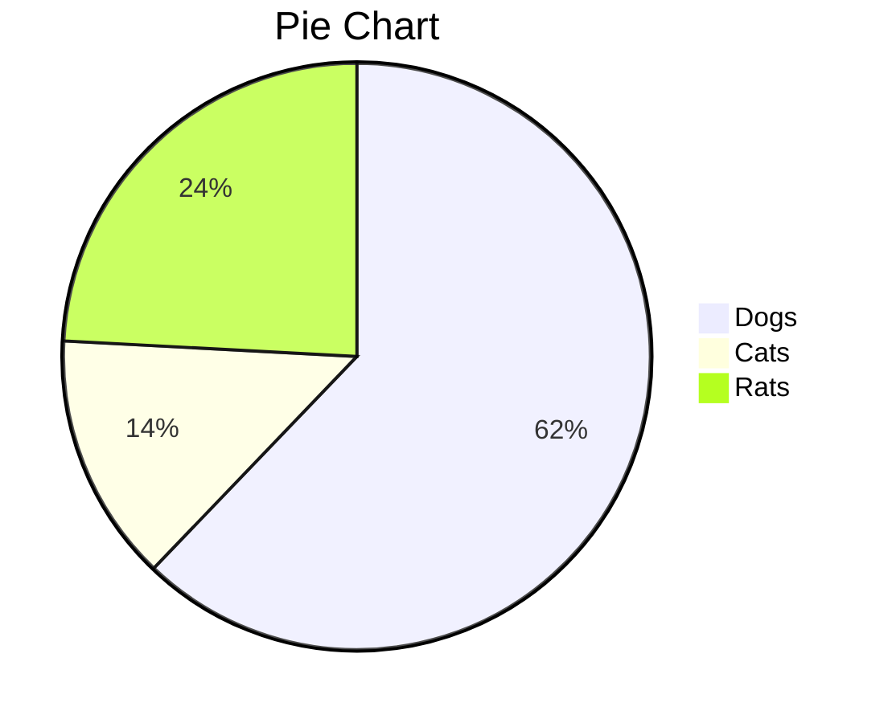

  

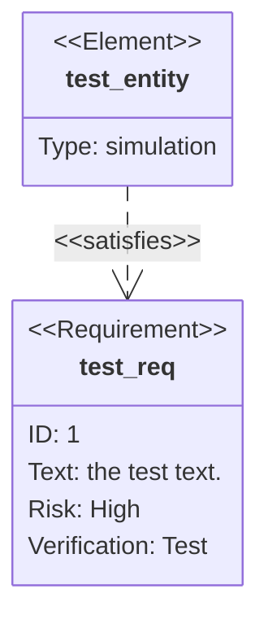

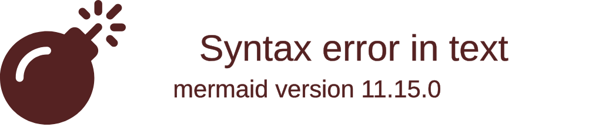

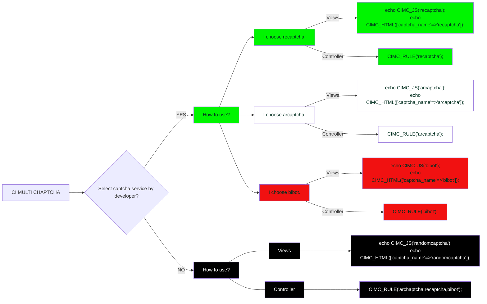
