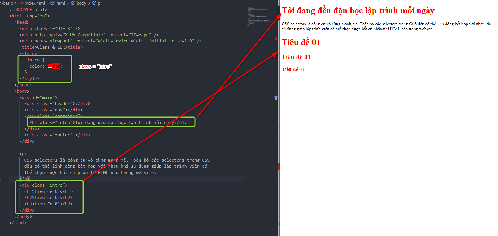
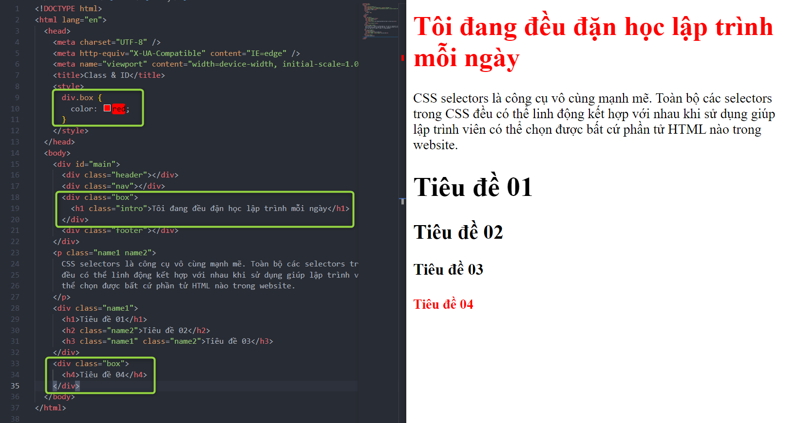

# CSS selector

---

### Giới thiệu

**Keyword:** `CSS selectors`

Trong CSS, `CSS selectors` là các cách chúng ta sử dụng để chọn ra các phần tử (elements) mà chúng ta muốn “style” cho chúng.

> _Chú ý:_ Thẻ có cách nói khác là Tag, khi các thẻ được trình duyệt “đọc” và render ra giao diện website thì có thể gọi các thẻ là các “phần tử” hay các “elements”.

---

### CSS selectors cơ bản

Trong bài này mình chỉ đưa ra những `CSS selectors ` cơ bản và thường xuyên được sử dụng nhất.

| STT | Selector          | Ví dụ         | Mô tả                                                                           |
| --- | ----------------- | ------------- | ------------------------------------------------------------------------------- |
| 1   | .class            | .intro        | Chọn tất cả các thẻ có class=“intro”                                            |
| 2   | .class1.class2    | .name1.name2  | Chọn tất cả các thẻ có cả name1 và name2 được đặt trong thuộc tính class của nó |
| 3   | .class1 .class2   | .name1 .name2 | Chọn tất cả các thẻ có class=“name2” là con của một phần tử có class=“name1”    |
| 4   | \*                | \*            | Chọn tất cả các thẻ                                                             |
| 5   | element           | h2            | Chọn tất cả các thẻ h2                                                          |
| 6   | element.class     | div.box       | Chọn tất cả thẻ div có class=“box”                                              |
| 7   | element, element  | div, h2       | Chọn tất cả thẻ div và h2                                                       |
| 8   | element element   | div p         | Chọn tất cả thẻ p trong thẻ div                                                 |
| 9   | element > element | div > p       | Chọn tất cả thẻ p là con trực tiếp của thẻ div                                  |
| 10  | element + element | div + p       | Chọn thẻ p đứng liền kề sau thẻ div                                             |
| 11  | element ~ element | div ~ p       | Chọn tất cả thẻ p đứng sau thẻ div                                              |

Tham khảo thêm tại: [w3schools css_selectors](https://www.w3schools.com/cssref/css_selectors.asp)

> CSS selectors là công cụ vô cùng mạnh mẽ. Toàn bộ các selectors trong CSS đều có thể linh động kết hợp với nhau khi sử dụng giúp lập trình viên có thể chọn được bất cứ phần tử HTML nào trong website.

---

### Một số ví dụ sử dụng CSS selectors

**Ví dụ 0:**

Để chọn toàn bộ tất cả các thẻ HTML chúng ta có thể sử dụng selector `*`. Trường hợp phổ biến nhất sử dụng selector này là khi `reset CSS` (loại bỏ các thuộc tính `margin` và `padding` mặc định của các thẻ HTML.

```css
* {
  padding: 0;
  margin: 0;
}
```

Như đoạn mã CSS trên thì toàn bộ các thẻ HTML đều có `padding` và `margin` bằng `0`. Mặc định thì một số thẻ như `h1-h6`, `p`, `ul`, `ol`, … sẽ có `padding` hoặc `margin` mặc định gây ra những sai lệch trong giao diện ngoài ý muốn của LTV.

Nên việc đưa `padding` và `margin` về `0` thường được gọi là `Reset CSS`.

> Reset CSS là công việc chúng ta thường làm ngay từ khi bắt đầu xây dựng một trang web.

> Sau này khi muốn một thẻ nào đó trong website có padding hoặc margin chúng ta chỉ cần đặt class và CSS cho thẻ đó như bình thường. Thuộc tính được CSS qua selector \* sẽ có độ ưu tiên thấp hơn các selectors khác.

---

**Ví dụ 1:**

Chọn các thẻ `.intro`

```
- Selector: .class
- Ví dụ: .intro
- Mô tả: Chọn tất cả các thẻ có class=`intro`
```



---

**Ví dụ 2:**

Chọn tất cả các thẻ có cả `name1` và `name2` được đặt trong thuộc tính class của nó.

```
- Selector: .class1.class2
- Ví dụ: .name1.name2
- Mô tả: Chọn tất cả các thẻ có cả name1 và name2 được đặt trong thuộc tính class của nó
```


---

**Ví dụ 3:**

Chọn tất cả các thẻ có `class=“name2”` là con của một phần tử có `class=“name1”`

```
- Selector: .class1 .class2
- Ví dụ: .name1 .name2
- Mô tả: Chọn tất cả các thẻ có class=“name2” là con của một phần tử có class=“name1”
```


---

**Ví dụ 4:**

Chọn tất cả các thẻ. Tất cả đều cùng 1 font size là 20px.

```
- Selector: *
- Ví dụ: *
- Mô tả: Chọn tất cả các thẻ
```


---

**Ví dụ 5:**

Chọn tất cả các thẻ h3 có font màu đỏ.

```
- Selector: element
- Ví dụ: h3
- Mô tả: Chọn tất cả các thẻ h3
```


---

**Ví dụ 6:**

Chọn tất cả thẻ div có class=“box”.

```
- Selector: element.class
- Ví dụ: div.box
- Mô tả: Chọn tất cả thẻ div có class=“box”
```



---

**Ví dụ 7:**

- Chọn tất cả thẻ `div` và thẻ `h5`.
- Chọn tất cả thẻ `div` và `box`.

```
- Selector: element, element
- Ví dụ: div, h5
- Mô tả: Chọn tất cả thẻ div và thẻ h5
```


---

**Ví dụ 8:**

Chọn tất cả thẻ `p` trong thẻ `div`.

```
- Selector: element element
- Ví dụ: div p
- Mô tả: Chọn tất cả thẻ p trong thẻ div
```


## 

**Ví dụ 9:**

Chọn tất cả thẻ `p` là con trực tiếp của thẻ `div`.

```
- Selector: element > element
- Ví dụ: div > p
- Mô tả: Chọn tất cả thẻ p là con trực tiếp của thẻ div
```


---

**Ví dụ 10:**

Chọn thẻ `p` đứng liền kề sau thẻ `div`.

```
- Selector: element + element
- Ví dụ: div + p
- Mô tả: Chọn thẻ p đứng liền kề sau thẻ div
```


---

**Ví dụ 11:**

Chọn tất cả thẻ `p` đứng sau thẻ `div`.

```
- Selector: element ~ element
- Ví dụ: div ~ p
- Mô tả: Chọn tất cả thẻ p đứng sau thẻ div
```


## 

**Ví dụ 12:**

Chọn các thẻ p

```html
<style>
  p {
    color: red;
  }
</style>

<h1>Heading 1</h1>
<p>Paragraph 1</p>
<p>Paragraph 2</p>
```

---

**Ví dụ 13:**

Chọn các thẻ có class `paragraph1`

```html
<style>
  .paragraph1 {
    color: red;
  }
</style>
<h1>Heading 1</h1>
<p class="paragraph1">Paragraph 1</p>
<p class="paragraph1">Paragraph 1</p>
<p>Paragraph 2</p>
```

---

**Ví dụ 14:**

Chọn các thẻ có class `paragraph` và class `p1`

```html
<style>
  .paragraph.p1 {
    color: red;
  }
</style>
<h1>Heading 1</h1>
<p class="paragraph p1">Paragraph 1</p>
<p class="paragraph p1">Paragraph 1</p>
<p class="paragraph">Paragraph 2</p>
```

---

**Ví dụ 15:**

Chọn các thẻ có class `children` là con của thẻ có class `parent`

```html
<style>
  .parent .children {
    color: red;
  }
</style>

<!-- Trường hợp .children là con trực tiếp của .parent -->
<div class="parent">
  <div class="children">Children 1</div>
  <div class="children">Children 2</div>
  <div class="children">Children 3</div>
</div>

<!-- Hoặc các .children nằm rải rác, miễn là con của .parent -->
<div class="parent">
  <div class="children">Children 1</div>

  <div class="other-div">
    <div class="children">Children 2</div>

    <div class="other-div">
      <div class="children">Children 3</div>
    </div>
  </div>
</div>
```

Để xem các ví dụ trực quan hơn các bạn hãy tham khảo qua công cụ “CSS selectors tester” rất trực quan, được xây dựng bởi w3school tại đây: [Ví dụ tại w3schools](https://www.w3schools.com/cssref/trysel.asp)

> **Theo tháp học tập:** Nếu chỉ đọc tài liệu này các bạn chỉ hiểu từ 5% - 15% kiến thức. Trong khi nếu vừa đọc vừa tự trải nghiệm bằng cách tự viết code, tự tìm hiểu bạn có thể nắm giữ lên tới 75% kiến thức.

Đừng chần chừ, tự mở IDE lên và thử nghiệm đi. Lần này không làm khả năng là không bao giờ làm đâu đấy nhé!

### Ghi chú

#### Phân biệt giữa div > .class, div .class và div + .class:

- `div > .class` : child selector, chọn tất cả phần tử con trực tiếp của div có thuộc tính lớp là "class".

- `div .class`: decendant (hậu duệ) selectors, chọn tất cả phần tử bên trong div có thuộc tính lớp là "class".

- `div + .class`: adjacent sibling selector, chọn phần tử đứng sau div có thuộc tính lớp là "class".

---

**Mẹo để nhớ:** Liên tưởng tới một gia đình có 3 thế hệ

- Ông A đẻ ra bố B, nên bố B là con trực tiếp của ông A.
- Bố B đẻ ra con C (thông qua mẹ, duh :v ) nên người con C là con trực tiếp của bố B.
- Với A thì B là con trực tiếp của A, còn C là cháu của ổng. Cả B và C đều là hậu duệ - "decendant" của ông A.
- Ngoài B thì ông A còn có nhiều người con nữa, và tương tự những người con đó lại có những đứa con khác.
- Đương nhiên, tất cả người con và cháu của ông A đều có điểm chung là mang 1 phần mã gene của ông A, nên có thể gán cho tất cả đám con cháu đó vô 1 class "hauDueOngA".

---

Kí tự ">" : Chỉ vào những phần tử con trực tiếp của phần tử bên trái. Ở đây là anh B và những người con khác của ông A.
Dấu cách " ": Chỉ tất cả những phần tử bọc trong phần tử bên trái. Ở đây là tất cả người con và cháu trong gia đình ông A.
Dấu "+": Một ngày nọ, anh D con ông A chán cảnh ồn ào trong gia đình ông A quá nên anh tách ra và thuê căn nhà ở liền sau nhà ông A cho tự lập, tiện trông nom nhòm ngó cho ông A. Dấu cộng ở đây dùng để chỉ anh D nhà ở liền sau nhà ông A nhưng vẫn mang class "hauDueOngA".

[CSS Selectors - difference between and when to use](https://stackoverflow.com/questions/43325543/css-selectors-difference-between-and-when-to-use-or)
