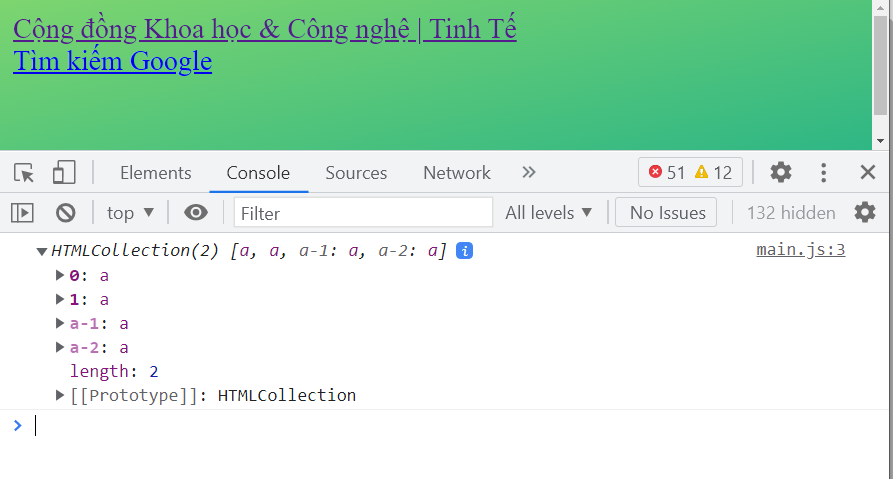
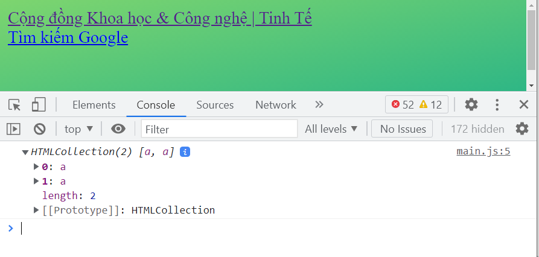
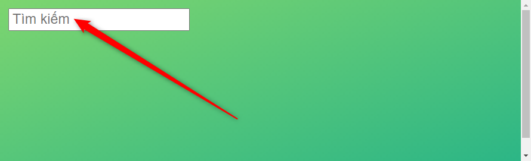
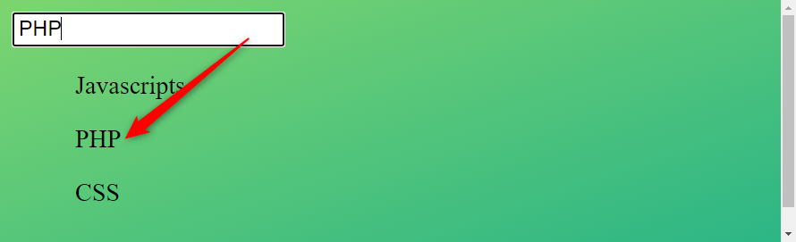
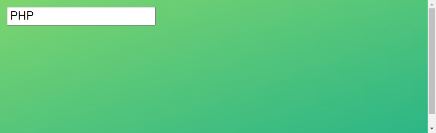
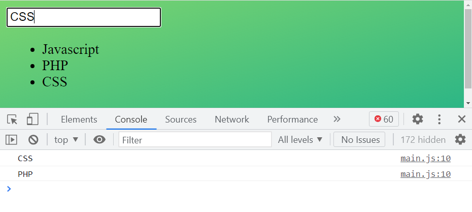
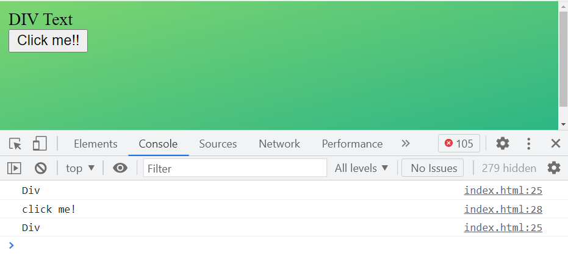
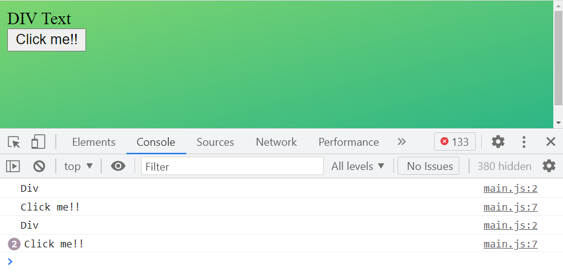

# PreventDefault and StopPropagation
---
- PreventDefault : Loại bỏ hành vi mặc định của trình duyệt trên một thẻ html.
- StopPropagation : Loại bỏ hành vi nổi bọt
---

## 1. PreventDefault

### 1.1 Ví dụ click chuột vào thẻ Anchor `<a>`
- Có file html như sau:
```html
  <body>
    <a href="https://tinhte.vn/"> 
      Cộng đồng Khoa học & Công nghệ | Tinh Tế 
    </a>

    <br />

    <a href="https://google.com.vn/">
      Tìm kiếm Google
    </a>
  </body>
```
- Khi click vào thẻ `<a>` sẽ dẫn đến trang website, đây là hành vi mặc định của thẻ `<a>`
- Đôi khi muốn chặn hành vi này, khi click vào thẻ `<a>` vẫn không dẫn đến link website này thì sẽ cần sử dụng `PreventDefault`

```html
  <body>
    <a Name="a-1" href="https://tinhte.vn/"> 
      Cộng đồng Khoa học & Công nghệ | Tinh Tế 
    </a>

    <br />

    <a Name="a-2" href="https://google.com.vn/">
      Tìm kiếm Google
    </a>
  </body>
```
```js

var aElements = document.anchors; // Buộc thẻ <a> phải có Name Attribute
console.log(aElements);
```


```js
// var aElements = document.querySelectorAll('a');
// var aElements = document.anchors; // Buộc thẻ <a> phải có Name Attribute
var aElements = document.links; 

console.log(aElements);
```



- Muốn nếu click vào link `tinhte.vn` sẽ không chuyển trang sẽ sử dụng thuộc tính `preventDefault` để ngăn chặn hành vi mặc định.

```js
var aElements = document.links;

for (var i = 0; i < aElements.length; i++) {
  aElements[i].onclick = function (e) {
    if (!e.target.href.includes('tinh')) {
      e.preventDefault(); // Chặn hành vi chuyển trang
    }
  };
}
```

### 1.2 Ví dụ xử lý thuộc tính CSS khi blur Element

```html
<html lang="en">
  <head>
    <meta charset="UTF-8" />
    <title>Demo</title>
    <style>
      /* Ẩn thẻ ul */
      ul {
        display: none;
      }
    
      /* Khi nhập vào input tìm kiếm sẽ hiện thẻ ul */
      input:focus ~ ul {
        display: block
      }
    </style>
  </head>

  <body>
    <input placeholder="Tìm kiếm"/>

    <ul>
      <li>Javascript</li>
      <li>PHP</li>
      <li>CSS</li>
    </ul>

  </body>
```





- Bình thường các thẻ `<li>` thuộc `<ul>` sẽ bị ẩn
- Khi gõ vào ô `<input>` `tìm kiếm` thì hiển thị các thẻ `<li>` (gần như gợi ý).
- Nhưng khi đưa con trỏ chuột chọn gợi ý thẻ `li` thì các thẻ `<li>` này bị ẩn đi do `<input>` mất `focus` do `blur`.
> Nhiệm vụ: Cần xử lý sau khi gõ `<input>` thì chuyển ra ngoài vẫn chọn được thẻ **`<li>`**.


```js
var ulElement = document.querySelector('ul');
var liElements = document.querySelectorAll('li');

// Bỏ hành vi mặc định khi bấm chuột vào ul 
ulElement.onmousedown = function(e){
  e.preventDefault();
}

for(var i = 0; i < liElements.length; i++){
  liElements[i].onclick = function(e){
    console.log(e.target.textContent);
  }
}
```



## 2. StopPropagation
- Loại bỏ hành vi nổi bọt thừa hưởng từ cấp cha tác động đến con.
- Ta có file html sau:

```html
  <body>

    <div onclick="console.log('Div')">
      DIV Text
      <br/>
      <button onclick="console.log('click me!')">
        Click me!!
      </button>
    </div>

  </body>
```



- Khi bấm vào chữ `DIV Text` thì log ra chữ `Div`
- Nhưng khi bấm vào `Button` `Click me!!` thì in ra chữ `Click me!` sau đó in tiếp chữ `Div`
- Nguyên nhân là  `Button` `Click me!!` đã thừa hưởng `onclick` từ Element cha là `div` nên sẽ lấy thuộc tính của cha => Đây được gọi là hành vi nổi bọt kế thừa tính chất.
- Để ngăn chặn hành vi nổi bọt này ta dùng thuộc tính `StopPropagation`.

```js
document.querySelector('div').onclick = function(e){
  console.log("Div");
}

document.querySelector('button').onclick = function(e){
  e.stopImmediatePropagation(); 
  console.log("Click me!!");
}
```


----------------------------------------------------------------
